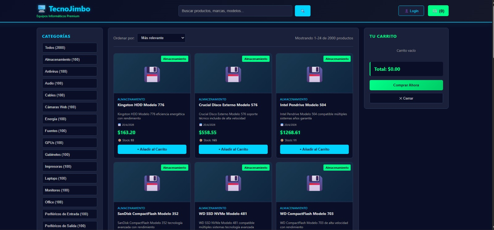
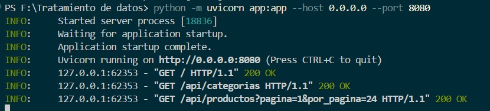

# G5-FastApi
Practica 2 Tratamientos de Datos

# 🖥️ TecnoJimbo - Tienda Tech Profesional

Bienvenido a **TecnoJimbo**, una plataforma de comercio electrónico moderna y ligera para la venta de equipos informáticos premium. El proyecto está construido con un enfoque en la velocidad y la simplicidad, utilizando **FastAPI** para el backend y tecnologías web puras para el frontend.

## 🚀 Características

- **Catálogo Dinámico**: Carga de productos desde un archivo JSON estructurado.
- **Búsqueda Avanzada**: Filtrado por texto en nombre y descripciones en tiempo real.
- **Categorización Inteligente**: Clasificación automática de productos con contadores dinámicos.
- **Paginación Eficiente**: Manejo de grandes volúmenes de datos mediante paginación desde el servidor.
- **Carrito de Compras**: Persistencia local (LocalStorage) para mantener tus productos incluso después de cerrar el navegador.
- **Diseño Futurista**: Interfaz "Dark Mode" con una estética limpia, profesional y responsiva.
- **Filtros y Ordenamiento**: Ordena por precio, disponibilidad o fecha de lanzamiento.

## 🛠️ Tecnologías Utilizadas

### Backend
- **Python 3.x**
- **FastAPI**: Framework web de alto rendimiento.
- **Uvicorn**: Servidor ASGI para producción y desarrollo.

### Frontend
- **HTML5 & Vanilla CSS**: Diseño moderno sin dependencias externas pesadas.
- **JavaScript (ES6+)**: Lógica interactiva y comunicación con la API mediante Fetch.

## 📦 Instalación

1. **Clonar el repositorio** (o descargar los archivos):
   ```bash
   git clone <url-del-repositorio>
   cd "Tratamiento de datos"
   ```

2. **Instalar dependencias**:
   Asegúrate de tener Python instalado y ejecuta:
   ```bash
   pip install -r requirements.txt
   ```

## 🎮 Ejecución

Para iniciar el servidor de desarrollo, utiliza el siguiente comando:

```bash
python -m uvicorn app:app --reload
```

Si deseas que el servidor sea accesible desde cualquier dispositivo en tu red local:

```bash
python -m uvicorn app:app --host 0.0.0.0 --port 8080
```

Luego, abre tu navegador en `http://localhost:8080`.

## 📂 Estructura del Proyecto

- `app.py`: Servidor principal y definición de la API REST.
- `data/`: Directorio que contiene el archivo `productos.json` (la base de datos).
- `static/`: Archivos CSS y JavaScript para la interfaz de usuario.
- `templates/`: Archivos HTML.
- `requirements.txt`: Lista de librerías de Python necesarias.


## Capturas de Pantalla
Aquí puedes ver algunas capturas de la aplicación en funcionamiento:






