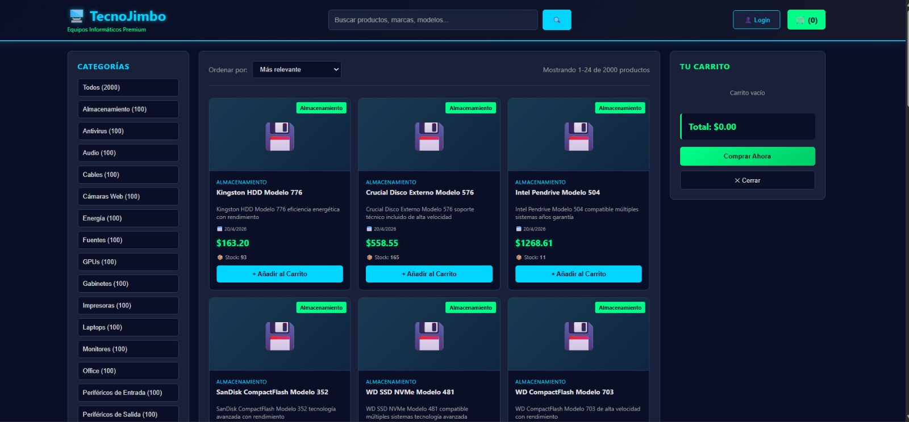
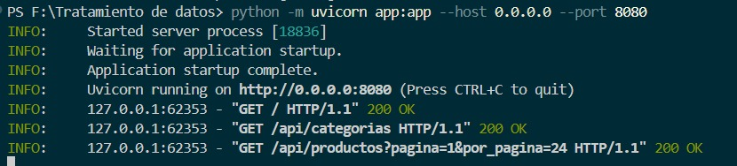
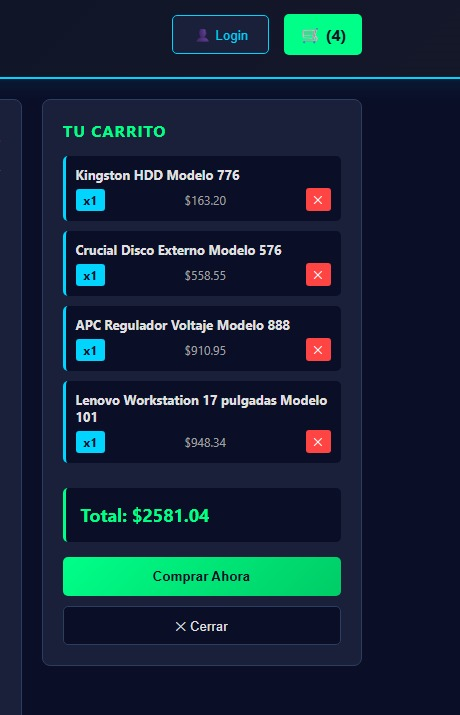
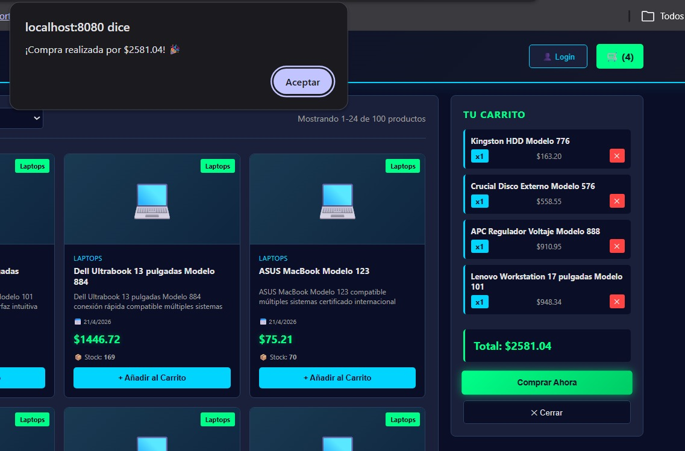

# G5-FastApi
Practica 2 Tratamientos de Datos

# 🖥️ TecnoJimbo - Tienda Tech Profesional

Bienvenido a **TecnoJimbo**, una plataforma de comercio electrónico moderna y ligera para la venta de equipos informáticos premium. El proyecto está construido con un enfoque en la velocidad y la simplicidad, utilizando **FastAPI** para el backend y tecnologías web puras para el frontend.

## 🚀 Características

- **Catálogo Dinámico**: Carga de productos desde un archivo JSON estructurado.
- **Búsqueda Avanzada**: Filtrado por texto en nombre y descripciones en tiempo real.
- **Categorización Inteligente**: Clasificación automática de productos con contadores dinámicos.
- **Paginación Eficiente**: Manejo de grandes volúmenes de datos mediante paginación desde el servidor.
- **Carrito de Compras**: Persistencia local (LocalStorage) para mantener tus productos incluso después de cerrar el navegador.
- **Diseño Futurista**: Interfaz "Dark Mode" con una estética limpia, profesional y responsiva.
- **Filtros y Ordenamiento**: Ordena por precio, disponibilidad o fecha de lanzamiento.

## 🛠️ Tecnologías Utilizadas

### Backend
- **Python 3.x**
- **FastAPI**: Framework web de alto rendimiento.
- **Uvicorn**: Servidor ASGI para producción y desarrollo.

### Frontend
- **HTML5 & Vanilla CSS**: Diseño moderno sin dependencias externas pesadas.
- **JavaScript (ES6+)**: Lógica interactiva y comunicación con la API mediante Fetch.

## 📦 Instalación

1. **Clonar el repositorio** (o descargar los archivos):
   ```bash
   git clone <url-del-repositorio>
   cd "Tratamiento de datos"
   ```

2. **Instalar dependencias**:
   Asegúrate de tener Python instalado y ejecuta:
   ```bash
   pip install -r requirements.txt
   ```

## 🎮 Ejecución

Para iniciar el servidor de desarrollo, utiliza el siguiente comando:

```bash
python -m uvicorn app:app --reload
```

Si deseas que el servidor sea accesible desde cualquier dispositivo en tu red local:

```bash
python -m uvicorn app:app --host 0.0.0.0 --port 8080
```

Luego, abre tu navegador en `http://localhost:8080`.

## 📂 Estructura del Proyecto

- `app.py`: Servidor principal y definición de la API REST.
- `data/`: Directorio que contiene el archivo `productos.json` (la base de datos).
- `static/`: Archivos CSS y JavaScript para la interfaz de usuario.
- `templates/`: Archivos HTML.
- `requirements.txt`: Lista de librerías de Python necesarias.


## Capturas de Pantalla
Aquí puedes ver algunas capturas de la aplicación en funcionamiento:












# Preguntas de Retroalimentación - G5
# 1. ¿Cómo podría un usuario malintencionado manipular directamente los datos almacenados en LocalStorage (por ejemplo, precios, cantidades o productos) para obtener beneficios indebidos, y qué implicaciones tendría esto si el backend confía en esos datos al procesar una compra?

El LocalStorage del navegador puede ser manipulado fácilmente por cualquier usuario, ya que es accesible desde las herramientas de desarrollo (DevTools). No se requieren conocimientos avanzados para modificar su contenido.
Un usuario puede acceder al LocalStorage presionando F12, dirigirse a la sección correspondiente y editar directamente los datos almacenados. Por ejemplo, si el carrito se guarda en formato JSON, es posible modificar atributos como el precio o la cantidad de los productos. Incluso, mediante la consola de JavaScript, se pueden ejecutar instrucciones como:
localStorage.setItem('carrito', JSON.stringify([{id: 101, precio: 0.50, cantidad: 10}]));
Esto permite alterar completamente la información del carrito. Además, si el sistema presenta vulnerabilidades como ataques de tipo XSS (Cross-Site Scripting), un atacante podría inyectar código que modifique el LocalStorage de otros usuarios.
Las implicaciones de confiar en estos datos desde el backend son graves. Si el servidor procesa la compra utilizando la información enviada por el cliente sin validación, pueden ocurrir problemas como fraude financiero, permitiendo la compra de productos a precios manipulados. También podrían generarse inconsistencias en los cálculos si se envían cantidades inválidas o negativas, o incluso acceder a productos no autorizados mediante la manipulación de identificadores.
La regla fundamental en el desarrollo web es no confiar en los datos provenientes del cliente. Para evitar este tipo de vulnerabilidades, el backend debe validar toda la información. El flujo correcto consiste en que el frontend envíe únicamente el identificador del producto y la cantidad, mientras que el backend consulta el precio real desde la base de datos, calcula el total y procesa la transacción de forma segura.
En conclusión, el LocalStorage debe considerarse un almacenamiento no confiable, y toda la lógica crítica debe gestionarse en el backend para garantizar la seguridad del sistema

# 2.	¿Cómo podría un atacante manipular el contenido de la página web origen para contaminar el dataset generado, y qué consecuencias tendría esto al utilizar esos datos en herramientas como Excel o Power BI?

Un atacante podría manipular el contenido de la página web origen alterando los datos que posteriormente son recolectados por procesos de scraping. Esto puede lograrse si el atacante tiene control sobre el sitio o mediante vulnerabilidades como ataques XSS (Cross-Site Scripting), permitiéndole inyectar contenido malicioso en los campos que luego serán procesados.

# Existen diversas formas de contaminar el dataset:
El atacante puede insertar valores que comiencen con símbolos como =, +, - o @. Por ejemplo, un campo podría contener una expresión que, al abrirse en herramientas como Microsoft Excel, sea interpretada como una fórmula y potencialmente ejecute comandos no deseados. 
Si el archivo generado utiliza comas como separadores y no se escapan correctamente los valores, un atacante puede insertar comas dentro de los campos, provocando desalineación de columnas y pérdida de integridad en el dataset. 
La inclusión de caracteres Unicode no visibles o saltos de línea puede afectar el procesamiento de datos, rompiendo scripts de limpieza o generando errores en herramientas de análisis. 

# Las consecuencias de utilizar estos datos contaminados en herramientas como Microsoft Excel o Microsoft Power BI pueden ser significativas:
En Excel, las celdas interpretadas como fórmulas pueden ejecutar acciones inesperadas, comprometiendo la seguridad del sistema del usuario. 
En Power BI, la presencia de datos inconsistentes o tipos incorrectos puede generar errores en cálculos, afectar métricas o excluir registros sin advertencia. 
La introducción de valores extremos o manipulados puede distorsionar indicadores clave, llevando a conclusiones incorrectas y decisiones basadas en información no confiable. 
Para mitigar estos riesgos, es fundamental implementar procesos de validación y sanitización de datos antes de su almacenamiento o análisis. Esto incluye limpiar caracteres sospechosos, validar tipos de datos y asegurar que la información provenga de fuentes confiables.
Si no se controla la integridad de los datos desde el origen, todo el proceso de análisis puede verse comprometido, afectando tanto la seguridad como la calidad de la información utilizada para la toma de decisiones.


